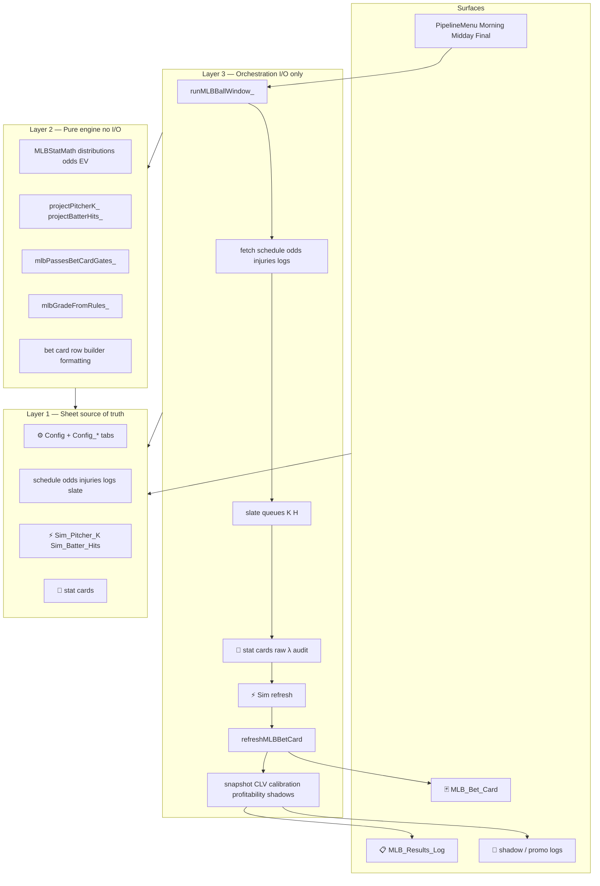

# MLB-BOIZ Platform Architecture — Structural Design

**Date:** 2026-05-26  
**Status:** Approved (2026-05-26) — Phase 1 implemented  
**Scope:** MLB-BOIZ betting pipeline only — daily ingest → projection → selection → snapshot → feedback. Google Sheets + Apps Script (`clasp push`).  
**Sources:** Syrakis Atlassian edge platform talk (Open Service Broker + **Sovereign** control plane); SMH platform spec (`docs/superpowers/specs/2026-05-23-smh-platform-architecture-design.md` in SMH-app repo); existing MLB sim + profitability specs.

**Related (do not duplicate numerics here):**

- `docs/superpowers/specs/2026-05-11-mlb-nba-parity-sim-architecture-design.md` — Sim layer contract, anchoring, phasing
- `docs/superpowers/specs/2026-05-22-profitability-robustness-design.md` — gates, calibration loop, model robustness
- `docs/2026-04-11-mlb-pitcher-k-pipeline-design.md` — K pipeline formulas, double-counting rules
- `docs/STATUS.md` — current feature inventory (may lag code; this spec calls out known drift)

---

## Problem

MLB-BOIZ already has a staged pipeline spirit (Ingest → Slate → Stats → Sim → Bet Card → Pipeline Log), but **structure has not kept pace with feature growth**. Symptoms:

- **`runMLBBallWindow_`** is a convergence point — one slow step or timeout affects the whole window; post-card analytics (calibration, profitability, compare panels) share the same run even though they are not required to produce today’s card.
- **Probability authority has drifted** — Sim tabs (`⚡ Sim_*`) and modules exist per the 2026-05-11 spec, but live **`🃏 MLB_Bet_Card`** currently merges from **`🎰 Pitcher_K_Card`** and **`🧪 Batter_Hits_Card_v2-full`** directly (`MLBBetCard.js`). Two code paths for “true” P and EV.
- **Config is partly in code** — park K/TB multipliers (`MLBParkFactors.js`), grade rubric thresholds (`MLBBetCardFormatting.js` / `mlbGradePlay_`), team abbr maps (`Config.js`). Tuning after calibration still often requires deploy.
- **Market modules duplicate edge concerns** — K card, Hits v2, Hits v3 shadow, HR promo, GS promo, streak picks each re-touch EV, gates, logging, and snapshot patterns instead of sharing one engine + one selection template.
- **Code churn hotspots** — bet card inclusion filters, Hits model versions, grader/boxscore plumbing. Repeated patches in the same files (Syrakis: churn predicts growing complexity until layers split).

**Symptom vs cause:** When the bet card “keeps breaking” or ROI tuning requires editing three files, the bug is usually **coupled responsibilities** — not the single line that threw.

---

## North star (12 months)

**Primary:** Each slate produces a **defensible, durable bet card** and **graded feedback loop** — even when optional APIs, shadow models, or analytics steps fail.

**Operational targets:**

| Stage | Target |
|-------|--------|
| **Ingest** | Schedule, odds, lineups, injuries land on canonical tabs; Pipeline Log shows funnel + warnings, not silent empty joins |
| **Project** | One **authoritative** probability path per live market (K, H); shadow models write separate logs only |
| **Select** | Gates and grades driven by **Config + calibration**, not hardcoded constants; tune without redeploy where possible |
| **Publish** | **`🃏 MLB_Bet_Card`** + Results Log snapshot succeed even if profitability/calibration/compare fail |
| **Learn** | FINAL run refreshes calibration + profitability proposals; operator can apply proposals to Config in one menu action |

If this north star is wrong, adjust before Phase 2 config expansion.

---

## Three principles (non-negotiable)

1. **Config is data, not code.** Thresholds, park factors, grade rubric, anchor weights, and gate rules editable on Sheet tabs — not `clasp push` to change a number.
2. **Publish persists the slate. Nothing else.** Bet card write + Results Log snapshot are the **broker** outcome. Grading backfill, CLV, calibration panels, profitability report, shadow snapshots, and compare panels are **workers** — each isolated; failure must not block publish.
3. **Code churn is a signal.** When the same function keeps breaking (`MLBBetCard.js`, Hits v2/v3 cards, grader), split layers — don't patch the symptom.

---

## Syrakis patterns (Atlassian edge → MLB-BOIZ scale)

Syrakis built three cooperating systems at Atlassian. MLB-BOIZ uses the same **roles**, scaled down from Kubernetes/SQS/DynamoDB/Envoy to Apps Script + Sheets + batch menu runs.

### Open Service Broker (accept → queue → worker → state)

| Atlassian | MLB-BOIZ equivalent |
|-----------|---------------------|
| Client submits provision request | Operator runs **Morning / Midday / Final** (`runMLBBallWindow_`) |
| Broker API accepts, enqueues, returns fast | **Ingest + project + publish** steps complete; bet card tab written |
| SQS holds async work | Post-publish **workers** in isolated try/catch (snapshot, CLV, calibration, profitability, shadow logs) |
| Worker provisions resources | Grade pending, backfill closing lines, refresh compare/ablation panels |
| DynamoDB holds state | Google Sheets tabs (`🃏`, `📋 MLB_Results_Log`, ingest tabs) |
| Client polls “is it ready?” | Menu **“only”** actions + Pipeline Log / Timings — rerun one stage without full window |

**Failure rules (from broker design):**

- If the odds API fails, schedule/injuries already on sheet must still allow a **degraded** card with warnings — not a silent empty card.
- If profitability report throws on FINAL, **bet card + snapshot must still exist** from the same run.
- If grader self-test fails, warn loudly (already done) — do not pretend grading is healthy.

### Sovereign (templates + context → rendered output)

| Atlassian | MLB-BOIZ equivalent |
|-----------|---------------------|
| Envoy listener/route/cluster templates | **Selection template** (gate rules), **grade template** (EV/odds → A+/A/…), **bet card layout** (`MLBBetCardFormatting.js`) |
| Context from broker DB, S3 | Candidate row + Sim output + `⚙️ Config` + schedule game time |
| Management server merges template + context | `mlbPassesBetCardGates_(row, rules)` + `mlbGradePlay_(ev, odds)` + merge/sort/caps |
| Developer sends simple JSON | Config keys (`MIN_MODEL_PCT_K_OVER`, `MAX_ODDS_H`, …) |
| Validate parameters before render | `validateMlbPipelineConfig_()` (extend); reject out-of-range keys before card build |

**Rule:** Change selection discipline by editing **Config / rules tab**, not by forking merge logic per market.

### Edge concerns (centralize once)

Atlassian handled auth, rate limiting, and access logs on the proxy before traffic hit thousands of backend services. MLB analogue: **orchestration + shared engine** own cross-market concerns once.

| Edge concern | Own it here | Do not duplicate in |
|--------------|-------------|---------------------|
| Poisson / binomial / EV / implied prob | `MLBStatMath.js` | Individual card files, bet card |
| Pipeline funnel + warnings | `MLBPipelineLog.js` | Every ingest module ad hoc |
| Config read + soft validation | `Config.js` (`getConfig`, `validateMlbPipelineConfig_`) | Hardcoded thresholds |
| Grader health | Start of `runMLBBallWindow_` | Per-market graders |
| Authoritative P for live picks | **`⚡ Sim_*`** (target) | Stat cards consumed directly by bet card |

Shadow/promo markets (Hits v3, HR promo, streak) may keep separate **surfaces**, but must call the same **engine** and **gate template** — not fork EV math.

---

## Target architecture: three layers

Maps broker/worker (orchestration) + Sovereign (engine render) + Sheet (data).



| Layer | Responsibility | Examples |
|-------|----------------|----------|
| **Data** | Canonical storage; config tabs with header rows | `⚙️ Config`, future `Config_Park`, `Config_Grades`, ingest tabs, `⚡ Sim_*`, `📋 MLB_Results_Log` |
| **Engine** | Pure functions: inputs → outputs; no `SpreadsheetApp`, no `UrlFetchApp` | `mlbPoissonCdf_`, `mlbEvPerDollarRisked_`, `projectPitcherK_(ctx)`, `mlbPassesBetCardGates_(row, rules)` |
| **Orchestration** | Fetch, write tabs, run window; broker publish + worker side effects | `runMLBBallWindow_`, `refreshPitcherKBetCard`, `refreshMLBBetCard`, `snapshotMLBBetCardToLog` |

**Rule:** Engine code must be runnable in the Apps Script editor with literal inputs. Orchestration may fail per side effect without undoing publish.

---

## Pipeline phases inside one window

Split **`runMLBBallWindow_`** into explicit **broker** and **worker** bands. Order preserved; failure isolation improved.

### Band A — Preflight (orchestration)

- Grader self-test (warn only)
- Grade pending (best-effort; timed per market)
- Cache resets

### Band B — Ingest (orchestration → data)

- Config build + `validateMlbPipelineConfig_`
- Injuries (skip Midday), schedule, lineups, game logs, odds, Savant (optional), slate board

### Band C — Project (orchestration → engine → data)

Per live market chain:

```
Queue → Stat card (raw λ + diagnostics) → Sim refresh → ⚡ tab
```

- **K:** `Pitcher_K_Queue` → `Pitcher_K_Card` → `refreshPitcherKSimEngine_`
- **H (live):** Hits queue → `Batter_Hits_Card_v2-full` → `refreshBatterHitsSimEngine_` (wire if not in main window)

Shadow/promo chains run **after** publish (Band E) unless they feed publish (e.g. streak highlight before format — keep explicit ordering comment in orchestrator).

### Band D — Publish (broker — must succeed for operator)

1. `refreshMLBBetCard` — reads **`⚡ Sim_*` only** for live K + H (reconcile drift; see § Current drift)
2. `MLBBetCardFormatting` — layout only
3. `snapshotMLBBetCardToLog(windowTag)` when card OK

**Acceptance:** Operator can open `🃏` and see today’s plays even if Band E fails entirely.

### Band E — Workers (isolated try/catch each)

Already partially implemented; formalize as non-blocking:

| Worker | When | On failure |
|--------|------|------------|
| Shadow snapshots (Hits v3, HR promo) | After publish | `addPipelineWarning_` |
| `refreshHitsModelCompare` | All windows | warning |
| `refreshBetCardCalibration` | All windows | warning |
| `mlbBackfillResultsLogClosingK_` | FINAL + odds OK | warning |
| `refreshProjectStatus` | All windows | warning |
| `runPitcherDataDiagnostic` | FINAL | warning |
| `refreshMLBProfitabilityReport` | FINAL | warning |
| `mlbWriteCalibrationProposals_` | FINAL | warning |

---

## Component audit (current repo)

Classification as of 2026-05-26. Update when refactoring.

### Already aligned

| Unit | File(s) | Notes |
|------|---------|-------|
| Shared math | `MLBStatMath.js` | Pure distributions + EV |
| Pipeline observability | `MLBPipelineLog.js`, timings in `PipelineMenu.js` | Funnel, warnings, step timing |
| Config on sheet | `Config.js` | `getConfig`, many tuning keys |
| Formatting split | `MLBBetCardFormatting.js` | Sovereign-style presentation |
| Post-card workers wrapped | `PipelineMenu.js` ~L368–452 | try/catch on snapshot, calibration, profitability |
| Sim modules | `MLBSimPitcherK.js`, `MLBSimBatterHits.js`, `MLBSimBatterTB.js` | Anchored layer implemented |
| Profitability + calibration | `MLBProfitabilityReport.js`, `MLBCalibration.js` | Feedback loop spec approved |

### Needs surgery

| Unit | File(s) | Issue | Target |
|------|---------|-------|--------|
| **Live bet card source** | `MLBBetCard.js` | Reads stat cards, not Sim tabs | Read `⚡ Sim_*` for K + H EV/model % |
| **Sim not in main window** | `PipelineMenu.js` | Sim refresh not in `step()` list | Add Sim steps after stat cards, before bet card |
| **Grade rubric in code** | `MLBBetCardFormatting.js` | `mlbGradePlay_` hardcoded thresholds | `Config_Grades` or Config keys + `mlbGradeFromRules_` |
| **Park factors in code** | `MLBParkFactors.js` | Static objects | `Config_Park` tab + accessor |
| **Stat cards mix I/O + math** | `MLBPitcherKBetCard.js`, `MLBBatterHitsV2.js`, … | Hard to test; shadow duplication | Extract `project*_(ctx)` pure functions |
| **Gate logic scattered** | `MLBBetCard.js` | Filters inline in merge loops | Single `mlbPassesBetCardGates_(row, cfg)` |
| **Monolithic window** | `PipelineMenu.js` | All markets in one chain | Optional scoped chains (`runKChainOnly_`, `runHChainOnly_`) for debug |

### Shadow / promo (second-class but same rules)

| Unit | Notes |
|------|-------|
| Hits v3, HR promo, GS promo, streak | Keep separate logs/tabs; must not become second live probability path; share engine + gate template |

---

## Current drift (explicit)

| Doc / expectation | Code today | Resolution |
|-------------------|------------|------------|
| `docs/STATUS.md`: bet card from `⚡ Sim_*` | `MLBBetCard.js` reads K card + Hits v2 card | Phase 1: wire Sim in pipeline + switch merge source |
| `2026-05-11` spec: Sim owns authoritative P | Anchoring may happen in card or sim depending on market | Phase 1 K then H: single write path to Sim, card deprecated for selection fields |
| TB in STATUS orchestrator list | TB retired from pipeline 2026-05-21 | Update STATUS separately; out of scope here |

---

## Phasing

Incremental — no big-bang re-file. Each phase independently deployable.

### Phase 1 — Broker/worker + Sim authority (highest leverage)

**Goal:** Publish durable; live P/EV from Sim only for K + H.

- Add Sim refresh steps to `runMLBBallWindow_` before bet card.
- Change `MLBBetCard.js` merge to read **`⚡ Sim_Pitcher_K`** and **`⚡ Sim_Batter_Hits`** (or rename aligned to live Hits path).
- Document Band D vs Band E in `PipelineMenu.js` comments.
- Log **`Sim Engine`** row in Pipeline Log when sim steps run.

**Acceptance:** For a Morning run, every K/H row on `🃏` traces model % and EV to Sim columns; disconnecting profitability worker does not empty card.

**Overlaps:** `2026-05-11` Phase 1 (K), Phase 2 (H); `2026-05-22` Phase 1 gates (keep gate template in bet card until Phase 2).

### Phase 2 — Config-as-data expansion

**Goal:** Tune without deploy.

| New tab / keys | Purpose |
|----------------|---------|
| `Config_Park` | K/TB mult by home abbr (migrate from `MLBParkFactors.js`) |
| `Config_Grades` | EV/odds → grade rules (migrate from `mlbGradePlay_`) |
| Extend `⚙️ Config` | Document all gate keys; calibration proposals write here |

Accessors in `Config.js`: `getParkKMult_(abbr)`, `getGradeRules_()`, `getBetCardGateRules_(cfg)`.

**Acceptance:** Edit park mult on sheet → next K card run picks it up; edit grade threshold → bet card grades change without code change.

### Phase 3 — Engine extraction

**Goal:** One pure projection function per market; orchestration files thin.

- `projectPitcherK_(ctx)` — λ components, park, platoon; returns `{ lambda, diagnostics }`
- `projectBatterHits_(ctx)` — v2 live; v3 calls same engine with different ctx flags
- `simPitcherK_(statRow, cfg)` — anchoring + pOver/pUnder (may stay in Sim file but pure)
- `mlbPassesBetCardGates_(row, rules)` — all inclusion checks

**Acceptance:** Run projection in editor with literal ctx object; shadow v3 differs only in ctx, not duplicated formulas.

### Phase 4 — Sovereign selection template

**Goal:** Calibration → Config → gates without touching merge code.

- Gate rules as structured data (side-aware K floors, H odds cap, MIN_EV, allowed grades).
- Optional: `mlbApplyCalibrationProposals_` writes proposals into gate rules section.
- Bet card merge becomes: load Sim rows → filter with gate template → grade → sort/caps/Kelly → render.

**Acceptance:** After calibration run, operator applies proposals; next FINAL card reflects new floors with no `MLBBetCard.js` edit.

### Phase 5 — Scoped chains (optional)

**Goal:** Debug resilience — partial pipeline without full window.

- `runKChainOnly_()` — ingest minimal + K queue → card → sim → card slice
- `runHChainOnly_()` — same for Hits
- Menu items under debug submenu

---

## Relationship to in-flight work

| Spec / plan | How it fits |
|-------------|-------------|
| `2026-05-11-mlb-nba-parity-sim-architecture-design.md` | Phase 1 here **implements** sim authority + pipeline logging |
| `2026-05-22-profitability-robustness-design.md` | Phase 1 broker/worker + Phase 4 gate template **closes** calibration feedback loop |
| `2026-05-12-batter-hr-promo-predictive-model-design.md` | Promo stays Band E; use shared engine when touching HR λ |
| SMH `2026-05-23-smh-platform-architecture-design.md` | Same three principles; this doc is the MLB betting analogue |

Implement profitability and robustness work **using** platform patterns (Sim-first, thin publish, config gates) rather than adding more inline filters.

---

## Non-goals

- Rewriting in Python, leaving Apps Script, or real-time WebSocket odds
- Big-bang rename to `MLBMenu.js` / `MLBSlate.js` / `MLBStats.js` file split from 2026 design doc
- Monte Carlo sim as headline (optional later behind same Sim interface)
- Multi-tenant or external API for third parties
- Re-enabling TB in live pipeline without new profitability evidence

---

## Success metrics

| Metric | How to measure |
|--------|----------------|
| Publish reliability | FINAL run leaves populated `🃏` + snapshot when profitability worker throws (injected test) |
| Single probability path | 100% of live K/H picks: model % column matches Sim tab on same slate |
| Config change without deploy | Edit `Config_Park` or grade rule → next run reflects change |
| Reduced churn | Fewer repeat edits to `MLBBetCard.js` for gate tuning after Phase 4 |
| Operator trust | Pipeline Log shows Sim step + worker warnings separately; no silent stat-card fallback |

---

## Phase 1 checklist (immediate next steps)

- [x] Review and approve this spec (2026-05-26)
- [x] Write implementation plan (`docs/superpowers/plans/2026-05-26-mlb-platform-architecture.md`)
- [x] Add `refreshPitcherKSimEngine_` + Hits sim step to `runMLBBallWindow_` before bet card
- [x] Switch `MLBBetCard.js` live merge to `⚡ Sim_*` tabs
- [x] Add Pipeline Log row for Sim Engine
- [ ] Verify Band E workers cannot block Band D (manual fault injection on profitability step)
- [x] Update `docs/STATUS.md` orchestrator list (Sim steps, TB retired) after Phase 1 ships

---

## Files touched (by phase)

| Phase | Files |
|-------|-------|
| 1 | `PipelineMenu.js`, `MLBBetCard.js`, `MLBPipelineLog.js`, `MLBSimPitcherK.js`, `MLBSimBatterHits.js` |
| 2 | `Config.js`, `MLBParkFactors.js`, `MLBBetCardFormatting.js`, `02_Setup` equivalent in `buildConfigTab` |
| 3 | `MLBPitcherKBetCard.js`, `MLBBatterHitsV2.js`, `MLBBatterHitsV3.js`, new `MLBProjectEngine.js` (optional focused module) |
| 4 | `MLBBetCard.js`, `MLBCalibration.js`, `Config.js` |
| 5 | `PipelineMenu.js` |

Prefer new focused modules over growing monoliths — current per-market file split is the right direction.
